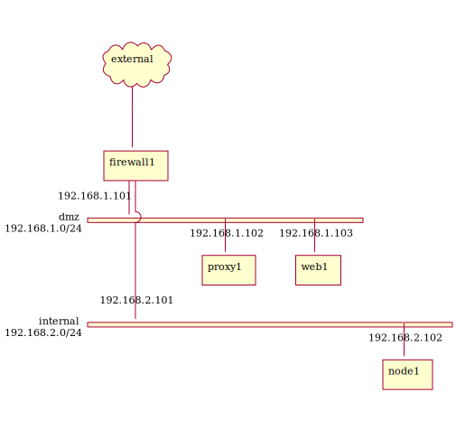

# Summary

- Single firewall DMZ example
- A proxy server and Web server in DMZ
- External network is reachable only from proxy server

# Network overview



## Firewall rules

|From    |To      |Accepted|Note    |
|:-------|:-------|:-------|:-------|
|external|web1    |Yes     |via firewall1 NAT|
|external|dmz     |No      |        |
|external|internal|No      |        |
|proxy1  |external|Yes     |        |
|dmz     |external|Partialy|via proxy1, web only|
|dmz     |internal|No      |        |
|internal|external|Partialy|via proxy1, web only|
|internal|dmz     |Yes     |        |

# Test

```
# initialized
vagrant up

# external to web1: Accepted
curl http://localhost:10080/

# internal to external without proxy: Rejected
vagrant ssh node1 --command "curl https://api.twilio.com/"

# internal to external with proxy: Accepted
vagrant ssh node1 --command "curl --proxy http://192.168.1.102:3128 https://api.twilio.com/"

# internal to dmz: Accepted
vagrant ssh node1 --command "curl http://192.168.1.103"
```


# Test environment

- Host
  - macOS Catalina 10.15.7
  - VirtualBox 6.1.16
  - Vagrant 2.2.10
- Guest
  - VirtualBox instance (memory 256MB)
  - CentOS 7 (centos/7 v2004.01)
