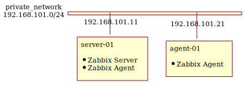

# Summary

- Zabbix v4.0 on CentOS 7
- One server and one agent
- Initial setup is done automatically

# Network overview

# Usage

1. `vagrant up`
2. Open http://127.0.0.1:10081/zabbix/ on your host machine.
3. Type username `Admin` and password `zabbix` to sign in.
3. Have fun.

# Test environment

- Host
  - macOS Big Sur 11.1
  - VirtualBox 6.1.16
  - Vagrant 2.2.10
- Guest
  - CentOS 7 (centos/7 v2004.01)